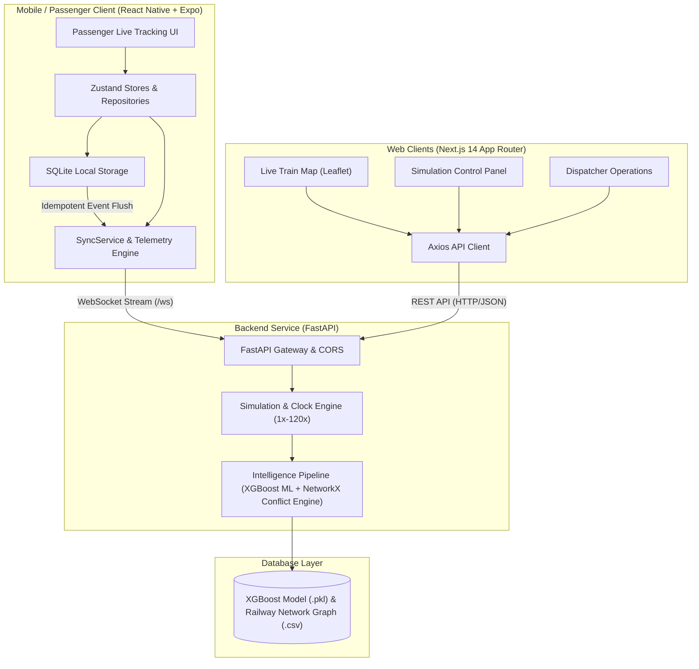

# 🚆 Real-Time Network-Aware ETA Forecasting & Conflict Resolution Engine for Indian Railways

[](https://fastapi.tiangolo.com)
[](https://python.org)
[](https://xgboost.readthedocs.io)
[](https://networkx.org)
[](https://developer.mozilla.org/en-US/docs/Web/API/WebSocket)
[](file:///d:/railway_model/backend/tests/run_tests.py)

---

## 1. Problem Statement

Indian Railways operates over 13,000 passenger trains daily across single-line and multi-line tracks, facing core operational bottlenecks:

* **Static Timetables Fail**: Timetables do not dynamically adapt to real-time weather disruptions (fog, rain, heat), causing inaccurate passenger ETAs.
* **Single-Track Contention**: When delayed trains contend for single-line block sections, manual dispatching causes severe cascading network delays.
* **Lack of Automated Precedence**: No automated system enforces operational priority (e.g. Vande Bharat vs Freight), resulting in traffic deadlocks and suboptimal throughput.

---

## 2. Our Solution

An **intelligent, network-aware train arrival forecasting, traffic conflict resolution, and deterministic simulation engine**:

1. **XGBoost ML Delay Prediction ($\hat{D}_N$)**: Predicts next-station delay in **~2.7 μs** using 8 features (lag-1 accumulated delay, departure hour, priority tier, and local atmospheric weather).
2. **NetworkX Conflict Resolution ($\Delta_{\text{conflict}}$)**: 181-station directed graph detects track contention, arbitrates via a **4-Tier Priority Hierarchy**, and applies statutory safety headways ($5.0\text{ min}$).
3. **Dynamic Final ETA**:
   $$\text{Final ETA} = \text{Scheduled Arrival} + \hat{D}_N + \Delta_{\text{conflict}}$$
4. **Deterministic Simulation & WebSockets**: Replays multi-train operations with adjustable clock speeds (1x to 120x) and streams real-time delta telemetry over `/ws`.

---

## 3. System Architecture Diagram



---

## 4. Tech Stack

| Category | Technology / Library | Usage & Purpose |
| :--- | :--- | :--- |
| **Backend Framework** | **FastAPI** (`0.115.0`) | High-performance async REST API and WebSocket gateway |
| **ASGI Server** | **Uvicorn** (`0.30.0`) | Lightning-fast async server runtime with hot reloading |
| **Machine Learning** | **XGBoost** (`2.1.0`) | Gradient-boosted regressor predicting next-station arrival delays |
| **Fast Linear Algebra** | **NumPy** (`1.26.0`) | Zero-copy contiguous 2D float32 vectors (~2.7 μs per inference) |
| **Graph & Topology** | **NetworkX** (`3.3`) | Directed multigraph representing 181 stations, tracks, and conflicts |
| **Data Processing** | **Pandas** (`2.2.0`) | Dataset loading and timetable extraction |
| **Data Validation** | **Pydantic V2** (`2.8.0`) | Type-safe request/response models and environment settings |
| **Real-Time Streaming**| **WebSockets** | Delta-compressed 1.0s broadcast stream (`/ws`) |
| **HTTP & Async I/O** | **HTTPX** (`0.27.0`) | Asynchronous non-blocking upstream API client for live feeds |
| **Caching Layer** | **In-Memory TTL Cache** | Async TTL cache with in-flight request deduplication/coalescing |
| **Live Telemetry API** | **RailRadar API** | Real-time Indian Railways GPS telemetry and running status |
| **Weather Feed** | **Open-Meteo API** | Atmospheric observations (fog, temperature, precipitation, wind) |
| **Testing Framework** | **Pytest** & Unified Runner | 57 automated unit, integration, and end-to-end test cases |

---

## 5. Quickstart & Execution Guide

### 1. Setup Environment
```powershell
# Navigate to repository root
cd d:\railway_model

# Create & activate virtual environment
python -m venv .venv
.\.venv\Scripts\Activate.ps1

# Install dependencies
pip install -r backend/requirements.txt
```

### 2. Configure (Optional)
If querying real-world live train status via RailRadar, set your API key:
```powershell
$env:RAILRADAR_API_KEY="your_actual_railradar_api_key_here"
```

### 3. Run Backend Server
```powershell
cd backend
python -m uvicorn app.main:app --host 127.0.0.1 --port 8000 --reload
```

* **Interactive Swagger UI**: [http://127.0.0.1:8000/docs](http://127.0.0.1:8000/docs)
* **ReDoc Documentation**: [http://127.0.0.1:8000/redoc](http://127.0.0.1:8000/redoc)
* **WebSocket Endpoint**: `ws://127.0.0.1:8000/ws`

### 4. Run Automated Test Suite (57/57 Tests)
```powershell
python backend/tests/run_tests.py
```

---

## 6. Key API Endpoints

| Method | Endpoint | Description |
| :--- | :--- | :--- |
| `GET` | `/api/health` | System health check & data mode status |
| `POST` | `/api/simulation/start` | Start virtual simulation clock |
| `POST` | `/api/simulation/pause` | Pause virtual simulation clock |
| `POST` | `/api/simulation/speed` | Set speed multiplier (e.g. `{"speed": 60.0}`) |
| `POST` | `/api/simulation/step` | Advance clock deterministically by `delta_seconds` |
| `GET` | `/api/simulation/state` | Full snapshot of all active trains and conflicts |
| `GET` | `/api/trains` | Summary roster of all trains with GPS coordinates |
| `GET` | `/api/trains/{trainNo}/eta` | Next-station timetable, ML delay, and final ETA |
| `GET` | `/api/trains/{trainNo}/conflicts` | Active single-line track conflict diagnostics |
| `GET` | `/api/trains/{trainNo}/live-status` | External live status via RailRadar |
| `WS` | `/ws` | Real-time WebSocket delta telemetry stream (1.0s interval) |
